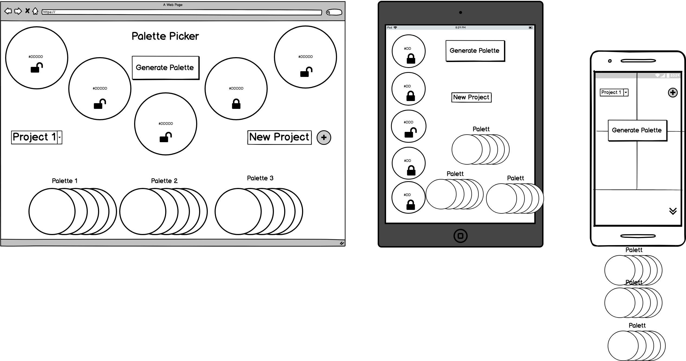

# Palette Picker
 
Palette Picker lets you sort through the colors of the rainbow to find pleasing combinations. Lock colors that you like until you pick a perfectly presented palette. 

Colors choices are saved to a project on the backend server so you can come back anytime. Also supports multiple projects with projects able to save multiple palettes.

### See it Live
[Coming Soon]()

### Primary Technologie(s)
* Express.js
* Front-End JS
* Sass

### Setup

1. Clone Down repo
2. `npm install` from the root directory
3. `npm start` and visit `localhost:3000` in your broswer

### Test Driven Development

`npm test` from the associated root directory

### Wireframes

### Screenshots

Coming soon!

### Original Assignment

[Palette Picker](http://frontend.turing.io/projects/palette-picker.html)

### Contributors

Tim Garrity: [Github](https://github.com/Salamandastron1)  
